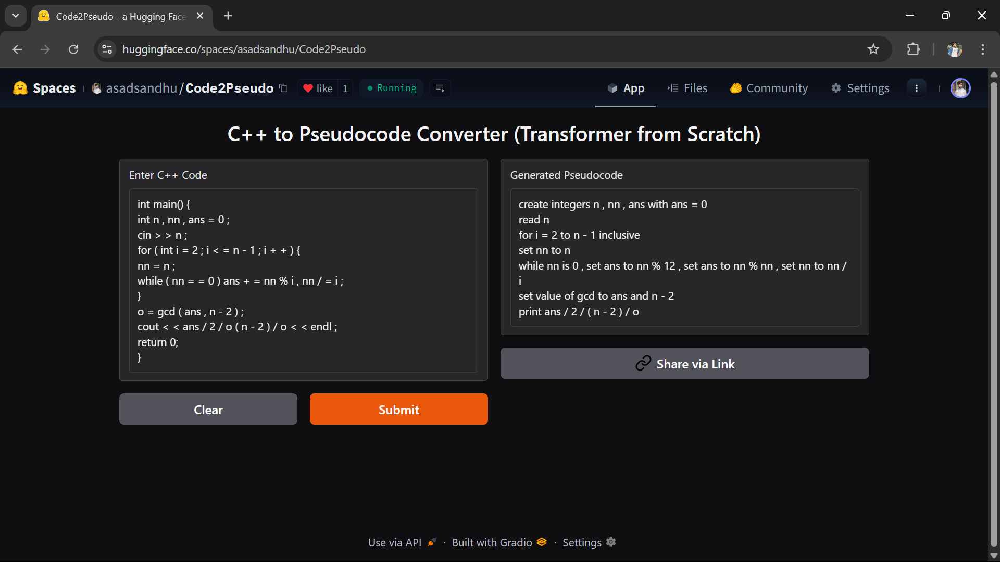

# 🔄 Code2Pseudo – Transformer-based C++ to Pseudocode Converter

[](LICENSE)
[](https://www.python.org/)
[](https://huggingface.co/spaces/asadsandhu/Code2Pseudo)
[](https://github.com/asadsandhu/Code2Pseudo)

> A fully custom Transformer-based Sequence-to-Sequence model built from scratch in PyTorch to convert executable C++ code into high-level pseudocode. Trained on the [SPoC dataset](https://arxiv.org/abs/2005.04326) from Stanford.

---

## 🖼️ Demo

Try it live on **Hugging Face Spaces**:  
👉 https://huggingface.co/spaces/asadsandhu/Code2Pseudo



---

## 🧠 Model Architecture

- Built from scratch using the **Transformer** encoder-decoder architecture (PyTorch)
- No pre-trained libraries – 100% custom code
- Token-level sequence generation with greedy decoding
- Custom tokenization and vocabulary building for both C++ and pseudocode

```

Input:   C++ lines (line-by-line)
Model:   Transformer (Encoder-Decoder)
Output:  Corresponding pseudocode line

```

---

## 📊 Dataset

We trained on the **SPoC dataset**:

- ✅ Cleanly aligned C++ ↔ pseudocode line pairs
- ✅ High-quality syntactic coverage
- ✅ Multiple test splits available
- ✅ Custom preprocessing and token handling

> 📎 Licensed under [CC BY 4.0](https://creativecommons.org/licenses/by/4.0/)

---

## 📁 Directory Structure

```

.
├── app.py                # Gradio web app (C++ → Pseudocode)
├── train.py              # Training script for code-to-pseudocode model
├── model.pth             # Trained model and vocab checkpoint
├── spoc/
│   └── train/
│       ├── spoc-train.tsv
│       └── split/spoc-train-eval.tsv
├── assets/
│   └── demo.png          # Screenshot for README
└── README.md             # This file

````

---

## 🛠️ How to Run Locally

### ⚙️ 1. Clone the Repo

```bash
git clone https://github.com/asadsandhu/Code2Pseudo.git
cd Code2Pseudo
pip install torch gradio tqdm
````

### 🚀 2. Launch the Web App

Make sure `model.pth` exists (or train it first):

```bash
python app.py
```

The interface will open in your browser.

---

## 🧪 Training the Model

To retrain the transformer model:

```bash
python train.py
```

By default:

* Downloads SPoC dataset from GitHub
* Trains for 10 epochs
* Produces `model.pth` with weights and vocabulary

---

## 🔧 Key Hyperparameters

| Parameter      | Value       |
| -------------- | ----------- |
| Model Type     | Transformer |
| Max Length     | 128         |
| Embedding Dim  | 256         |
| FFN Dim        | 512         |
| Heads          | 4           |
| Encoder Layers | 2           |
| Decoder Layers | 2           |
| Batch Size     | 64          |
| Epochs         | 10          |
| Optimizer      | Adam        |
| Learning Rate  | 1e-4        |

---

## 🧩 Example Input

```cpp
int main() {
int n , nn , ans = 0 ;
cin > > n ;
for ( int i = 2 ; i < = n - 1 ; i + + ) {
nn = n ;
while ( nn = = 0 ) ans + = nn % i , nn / = i ;
}
o = gcd ( ans , n - 2 ) ;
cout < < ans / 2 / o ( n - 2 ) / o < < endl ;
return 0;
}
```

### ⏩ Output Pseudocode

```text
create integers n , nn , ans with ans = 0
read n
for i = 2 to n - 1 inclusive
set nn to n
while nn is 0 , set ans to nn % 12 , set ans to nn % nn , set nn to nn / i
set value of gcd to ans and n - 2
print ans / 2 / ( n - 2 ) / o
```

---

## 📦 Deployment

Live demo hosted on:

* **Hugging Face Spaces**: [Code2Pseudo](https://huggingface.co/spaces/asadsandhu/Code2Pseudo)
* **GitHub**: [github.com/asadsandhu/Code2Pseudo](https://github.com/asadsandhu/Code2Pseudo)

---

## 🙌 Acknowledgements

* 📘 **SPoC Dataset** by Stanford University
  Kulal, S., Pasupat, P., & Liang, P. (2020). [SPoC: Search-based Pseudocode to Code](https://arxiv.org/abs/2005.04326)

* 🧠 Transformer Paper: ["Attention is All You Need"](https://arxiv.org/abs/1706.03762)

---

## 🧑‍💻 Author

**Asad Ali**
[GitHub: asadsandhu](https://github.com/asadsandhu)
[Hugging Face: asadsandhu](https://huggingface.co/asadsandhu)
[LinkedIn: asadxali](https://www.linkedin.com/in/asadxali)

---

## 📄 License

This project is licensed under the MIT License.
Use, remix, and distribute freely with attribution.
